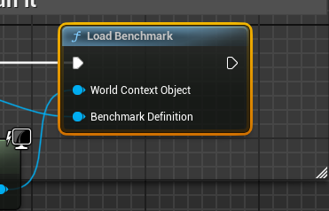

# P6Benchmark
This is a very simple plugin to enable creating a simple in-game benchmark mode. It allows you to load a map and play through predefined camera paths using level sequences, reporting some simple performance metrics after the run.

It is not inteded for automated testing. It is meant to be integrated to your game, launched from your main menu, settings screen, developer console command and so on.

If you want an actual plugin that plays nicely with the Unreal testing framework, go here:
https://dev.epicgames.com/community/learning/talks-and-demos/0zx9/unreal-engine-a-tech-artist-s-guide-to-automated-performance-testing-unreal-fest-bali-2025

If available in your build, the benchmark can automatically
- Run the built-in `startfpschart/stopfpschart` command. This produces a small CSV file with performance metrics.
- Start and stop an Insights trace. It will add a trace bookmark for each camera cut, for easier analysis.

## How to use

Sample data is provided in Content/Example/. Open L_Benchmark_Launcher and press play.

Create a level sequence that performs a flythrough of the map. Each camera in the sequence will be reported as a separate section. https://dev.epicgames.com/documentation/en-us/unreal-engine/unreal-engine-sequencer-movie-tool-overview
Remember you can make the cameras and camera rigs as sequencer Spawnables so you don't have to save anything in your level.
To parent spawned cameras to spawned camera rigs, add an Attach track to your Camera.

Create a data asset for the level you want to benchmark (Miscellaneous -> Data Asset -> P6BenchmarkDefinition). In the data asset, assign your level and sequence.

To launch a benchmark, you'll need an entry point (specific to your game) that calls LoadBenchmark. See `Content/Example/Launcher/`.
 
 

Once loaded, the benchmark runs automatically and presents a results screen at the end. You'll want to customize the presentation for your project by providing a custom results widget class. Go to Project Settings -> P6Benchmark and change the default Results Widget class:

IMAGE HERE

### Customizing the flow

Document here
- Custom game mode
- Custom loading widget class
- PSO proloading

### Asset Manager

`P6BenchmarkDefinition` is a Primary Data Asset. You can register the type in your Asset Manager (https://dev.epicgames.com/documentation/en-us/unreal-engine/asset-management-in-unreal-engine). This includes your benchmark map in the cook, and allows iterating benchmark definitions at runtime - great if you want to put your benchmark inside a game feature plugin and have it toggleable at build time.

## License
```
The MIT License (MIT)
Copyright (c) 2025 Kimmo Kotajärvi

Permission is hereby granted, free of charge, to any person obtaining a copy of this software and associated documentation files (the "Software"), to deal in the Software without restriction, including without limitation the rights to use, copy, modify, merge, publish, distribute, sublicense, and/or sell copies of the Software, and to permit persons to whom the Software is furnished to do so, subject to the following conditions:

The above copyright notice and this permission notice shall be included in all copies or substantial portions of the Software.

THE SOFTWARE IS PROVIDED "AS IS", WITHOUT WARRANTY OF ANY KIND, EXPRESS OR IMPLIED, INCLUDING BUT NOT LIMITED TO THE WARRANTIES OF MERCHANTABILITY, FITNESS FOR A PARTICULAR PURPOSE AND NONINFRINGEMENT. IN NO EVENT SHALL THE AUTHORS OR COPYRIGHT HOLDERS BE LIABLE FOR ANY CLAIM, DAMAGES OR OTHER LIABILITY, WHETHER IN AN ACTION OF CONTRACT, TORT OR OTHERWISE, ARISING FROM, OUT OF OR IN CONNECTION WITH THE SOFTWARE OR THE USE OR OTHER DEALINGS IN THE SOFTWARE.
```
